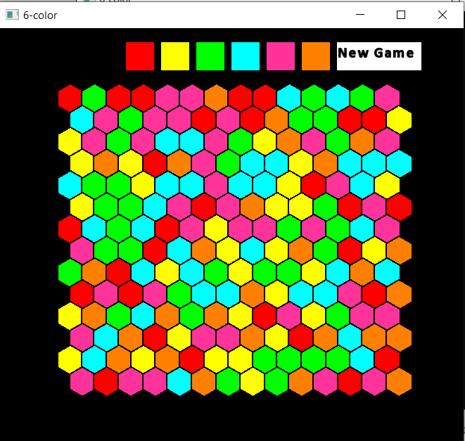

# Six Colors - Hexagon Game

## General Description

"Six Colors" is a hexagon-based game implemented using the SFML (Simple and Fast Multimedia Library) graphical library. The game includes two players - a human and a computer.

## Project Structure

### Main Files

1. **Algorithm**
   - Responsible for BFS algorithm calculation and additional helper calculations.

2. **BaseComputer** (Abstract class)
   - Inherited by:
     - **GlobalComputer**: Global greedy player
     - **LocalComputer**: Local greedy player
     - **RegularComputer**: Random player

3. **Board**
   - Holds the "board" - a vector of hexagons.

4. **Hexagon**
   - Contains `sf::CircleShape m_hexagon` and color information.

5. **Cell**
   - Contains a `Hexagon` and a vector of its neighbors.

6. **Controller**
   - Responsible for game management and holding various objects.

7. **Display**
   - Shows options for player type selection.

8. **Menu**
   - Displays colors for selection.

9. **Player**
   - User class.

10. **Utilities**
    - Contains program constants.

### Main Data Structures

- `Cell`: Contains `Hexagon` and a vector of neighbors.
- `Board`: Vector of `Cell`.
- `Controller`: 
  - `std::vector<std::shared_ptr<Cell>> m_userVec`
  - `std::vector<std::shared_ptr<Cell>> m_computerVec`

## Key Algorithms

1. **BFS**
   - Used for the global player.
   - Provides the longest path for a specific color.

2. **Random Color Selection for Path**
   - Used for the random player.

3. **Local Color Check**
   - For the local player.
   - Checks which color will give the best result among the 6 closest neighbors.

## Design

- Inheritance: `GlobalComputer`, `LocalComputer`, `RegularComputer` inherit from `BaseComputer`.
- Composition: `Cell` contains `Hexagon`.

## Operation Instructions

### Requirements

- C++ compiler with C++11 support or later
- SFML library (version 2.5 or later recommended)

### Building and Running

1. Ensure you have SFML installed on your system. You can download it from the [official SFML website](https://www.sfml-dev.org/download.php).

2. Clone this repository:
   ```
   git clone [repository URL]
   cd [repository directory]
   ```

3. Compile the project:
   ```
   g++ -c *.cpp
   g++ *.o -o SixColors -lsfml-graphics -lsfml-window -lsfml-system
   ```

4. Run the game:
   ```
   ./SixColors
   ```

Note: Depending on your SFML installation, you might need to adjust the include paths and library paths in your compilation command.




